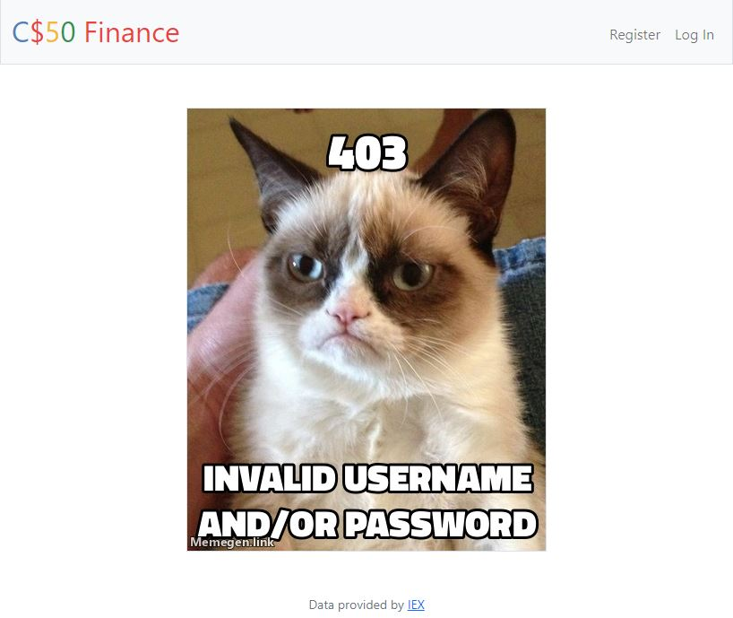

Finance CS50 is and Web App that comunicates with an [API](https://cloud.iexapis.com/stable/stock/nflx/quote?token=API_KEY) and get information about Stocks and can find/buy/sell them at the current price of the market!, it has the following features!
- Login/Register 

- Find the name of the stock and show it after find the first match

- Buy stocks if your stack allows it!

- Sell your Stocks at the current price the market has!

- History -> It show your movements Buys/Sells !

- Handling Errors if you are trying do to something wrong
